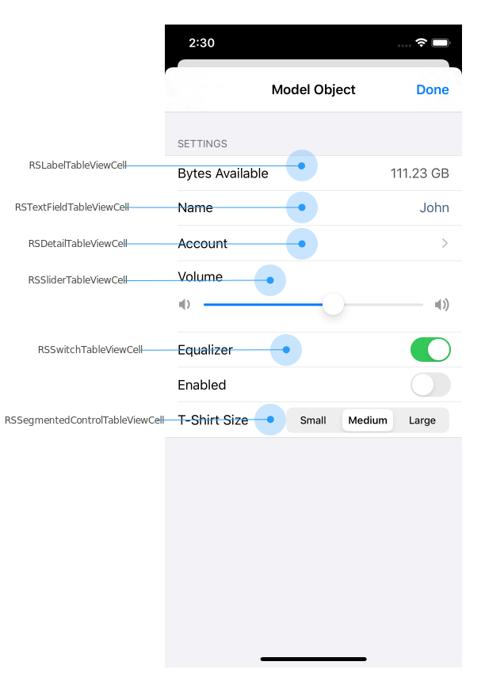

# Forma

Forma is an Objective-C library for implementing forms, settings, and inspector view controllers.

**Warning**: this project is unsupported, not under active development, and not intended for a general audience. I originally wrote the library for my own projects a long time ago and have since incorporated it into other projects for clients. I continue to support the library for these audiences, but otherwise don’t plan on maintaining the library.

## Overview



## Architecture

Forma uses the MVC pattern at a granular level.

The main Forma classes can be conceptually grouped into three main categories:

- **Form items**: these are controller classes. Each form item has a table view cell. At a high level, there are three types of form items:
  - **property form items**: these are controllers that observe a property on an object. Property form items can be either *viewers* or *editors*; viewers only display an object’s property value, while editors allow modification of an object’s property value.
  - **form buttons**: a button, typically used to “submit” a form. For example, if a form is used to enter account credentials (username and password), the form might contain a “Sign In” form button.
  - **navigation items**: a form item that navigates to another form. This is primarily used to partition a form into subforms to reduce the complexity.
- **Form sections**: an ordered collection of form items.
- **Table view cells**: custom table view cell classes that implement the UI for form items.

## UML


## Property Editors

| Property Editor             | Description                          | Table View Cell Class                             |
| --------------------------- | ------------------------------------ | ------------------------------------------------- |
| `RSBooleanPropertyEditor`   | Edits a boolean property.. | `RSSwitchTableViewCell` |
| `RSDiscreteNumericPropertyEditor` | Edits a numeric property, allowing selection from a predefined set of possible numeric values. | `RSStepperTableViewCell` |
| `RSEnumPropertyEditor` | Edit a property with an `enum` type. | `RSSegmentedControlTableViewCell` |
| `RSFloatPropertyEditor`     | Edit a float property with a slider. | `RSSliderTableViewCell`                           |
| `RSNumberPropertyEditor`    | Edit a number with a text field.     | `RSTextFieldTableViewCell`                        |
| `RSObjectPropertyEditor`    |                                      | `RSLabelTableViewCell` |
| `RSFormItem`          | Base class for all property editors. |   |
| `RSTextInputPropertyEditor` | Edit a property value with a text field. Non-text properties are supported by using an `NSFormatter` to convert between text/object representations. | `RSTextFieldTableViewCell`                        |

## Table View Cells

| Table View Cell Class              |      |
| ---------------------------------- | ---- |
| `RSButtonTableViewCell`            |      |
| `RSDetailTableViewCell`            |      |
| `RSLabelTableViewCell`             |      |
| `RSSliderTableViewCell`            |      |
| `RSSegementedControlTableViewCell` |      |
| `RSSwitchTableViewCell`            |      |
| `RSTextFieldTableViewCell`         |      |

## Validation

Form validation is accomplished by two mechanism:

- Forma performs property-level validation via Cocoa’s key-value validation. See Apple’s documentation: [Adding Validation](https://developer.apple.com/library/archive/documentation/Cocoa/Conceptual/KeyValueCoding/Validation.html).
- Forma performs form-level validation via the `-isFormValid:` method from the `RSFormDelegate` protocol. Implement `-isFormValid:` to implement validation that depends on multiple properties. For example, a change-password form might require entering the new password twice. Form-level validation is appropriate here to check that both password fields have the same value.

When using `-isFormValid:` to perform validation, it’s important that validation is performed against the uncommitted values of the form and not the model object property values. For example, suppose a change-password form has two passwords fields: `newPassword1` and `newPassword2`. For the form to be valid, the values entered for these fields must be the same. The correct way to do this is:

```objc
- (BOOL)isFormValid:(RSForm *)form {
	NSString *newPassword1Editor = (RSTextInputPropertyEditor *)[form formItemForKey:@"newPassword1];
	NSString *newPassword2Editor = (RSTextInputPropertyEditor *)[form formItemForKey:@"newPassword2];

	return [newPassword1Editor.currentText isEqualToString:newPassword2Editor.currentText];
}
```

## File Organization

Updating the `include` directory:

```sh
ls -1 ../Core/*.h | xargs -J % ln -s % .
ls -1 ../FormItems/*.h | xargs -J % ln -s % .
ls -1 ../TableViewCells/*.h | xargs -J % ln -s % .
```
